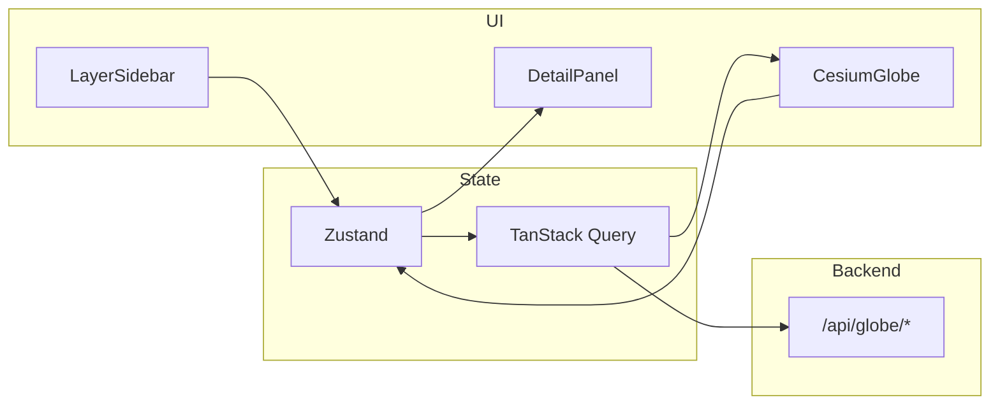

# BioScan Frontend — arquitetura e guia de desenvolvimento

Guia **passo a passo** para implementar o cliente web do BioScan: globo 3D, camadas ambientais, painéis de UI e integração com a API REST do backend.

Documentos relacionados:

| Documento | Conteúdo |
|-----------|----------|
| [`ideia.md`](ideia.md) | Visão de produto e experiência do utilizador |
| [`referencias/stitch (1)/DESIGN.md`](referencias/stitch%20(1)/DESIGN.md) | Cores, tipografia, layout |
| [`../../IDEIA.md`](../../IDEIA.md) | Propósito geral do BioScan |
| [`../../README.md`](../../README.md) | API REST, rotas, contrato `PontoGloboV1` |
| [`../../Endpoits.md`](../../Endpoits.md) | **Catálogo completo de endpoints** — query, resposta, exemplos fetch |

---

## 1. Stack escolhida

| Camada | Tecnologia | Motivo |
|--------|------------|--------|
| Linguagem | **TypeScript** | Tipos alinhados ao contrato `PontoGloboV1` do backend |
| UI | **React 19** | Ecossistema maduro, componentes reutilizáveis |
| Build | **Vite** | Dev rápido, HMR, deploy simples |
| Globo 3D | **CesiumJS** | Planeta real, milhões de pontos, camadas temporais, GIS |
| Estilos | **Tailwind CSS v4** | Design system escuro imersivo (ver DESIGN.md) |
| Dados remotos | **TanStack Query** | Cache, refetch, estados loading/error por camada |
| Estado local | **Zustand** | Camadas activas, selecção, viewport, UI (sidebar aberta…) |
| HTTP | **fetch** nativo | Sem axios no cliente; backend já normaliza respostas |
| Testes | **Vitest** + **Testing Library** | Unitários de adaptadores e componentes |
| E2E (fase tardia) | **Playwright** | Fluxo ligar camada → ver ponto → painel detalhe |

**Alternativa para MVP mais rápido:** substituir Cesium por **globe.gl** (Three.js). A arquitectura abaixo mantém-se; só muda o módulo `globe/cesium/`.

---

## 2. Pré-requisitos

Antes de codificar o frontend:

1. **Node.js 20+** (alinhado ao backend).
2. **Backend a correr** em `http://localhost:3000` (`npm run dev` na raiz do repositório).
3. Confirmar **`GET /health`** e **`GET /api/globe`** no browser ou Postman.
4. Para camadas condicionais (fogo NASA, espécies GBIF): MongoDB + chaves no `.env` do backend — ver README.
5. **Conta Cesium Ion** (gratuita) para token de terreno/imagens base — [cesium.com/ion](https://cesium.com/ion/). Alternativa: usar `OpenStreetMap` ou imagery sem Ion no protótipo (qualidade inferior).

---

## 3. Estrutura de pastas (alvo)

O código da app vive em `frontend/` (ao lado de `frontend/docs/`):

```
frontend/
├── docs/                          # Documentação (não vai para produção)
├── public/
│   └── cesium/                    # Workers/assets Cesium (copiados no build)
├── src/
│   ├── main.tsx
│   ├── App.tsx
│   ├── index.css                  # Tailwind + tokens do DESIGN.md
│   │
│   ├── api/                       # Cliente HTTP + tipos partilhados com backend
│   │   ├── client.ts              # baseURL, fetch wrapper, erros humanos
│   │   ├── types/
│   │   │   └── globe.ts           # PontoGloboV1, RespostaCamadaGloboV1
│   │   └── endpoints/
│   │       ├── health.ts          # GET /health
│   │       ├── globe.ts           # GET /api/globe, /sismos, /especies-ameacadas
│   │       ├── fire.ts            # GET /api/fire, /api/fire/nasa
│   │       ├── ocean.ts           # GET /api/ocean, /api/ocean/epa
│   │       ├── meteo.ts           # GET /api/meteo/*
│   │       ├── panel.ts           # gistemp, ice-melt, extinction
│   │       └── proxy.ts           # earthquakes, events, openaq, deforestation (opcional)
│   │
│   ├── layers/                    # Uma pasta por camada lógica
│   │   ├── registry.ts            # Catálogo: id → definição da camada
│   │   ├── types.ts               # GlobeLayerDefinition, LayerStatus
│   │   ├── sismos/
│   │   │   ├── sismosLayer.ts     # fetch + map severidade → cor
│   │   │   ├── sismosDetail.tsx   # Texto humano no painel detalhe
│   │   │   └── README.md
│   │   ├── incendio-nasa/
│   │   ├── lixo-marinho-epa/
│   │   └── especies-ameacadas/
│   │
│   ├── globe/                     # Tudo o que toca no Cesium
│   │   ├── CesiumGlobe.tsx        # Componente React + ref ao Viewer
│   │   ├── useCesiumViewer.ts     # Ciclo de vida, destroy, resize
│   │   ├── layerRenderer.ts       # PontoGloboV1 → Entity/PointGraphics
│   │   ├── clustering.ts          # Agrupamento por zoom
│   │   ├── colors.ts              # severidade → cor semântica
│   │   └── camera.ts              # flyTo, bbox visível
│   │
│   ├── store/
│   │   └── useAppStore.ts         # Zustand: layers, selection, ui
│   │
│   ├── components/
│   │   ├── layout/
│   │   │   ├── AppShell.tsx       # Top bar + slots laterais
│   │   │   ├── TopBar.tsx
│   │   │   ├── LayerSidebar.tsx
│   │   │   └── DetailPanel.tsx
│   │   ├── layers/
│   │   │   ├── LayerToggle.tsx
│   │   │   └── LayerGroup.tsx
│   │   └── ui/                    # Botões, chips, glass cards (DESIGN.md)
│   │
│   ├── hooks/
│   │   ├── useGlobeLayers.ts      # Liga store + Query + renderer
│   │   └── useVisibleBbox.ts      # bbox da câmara → query params
│   │
│   └── lib/
│       ├── format.ts              # datas, coordenadas (JetBrains Mono)
│       └── humanCopy.ts           # Frases curtas por tipo de ponto
│
├── .env.example
├── index.html
├── package.json
├── tsconfig.json
├── vite.config.ts
└── README.md
```

### Disciplina por camada (espelho do backend)

Cada pasta em `src/layers/<nome>/` deve ter:

| Ficheiro | Responsabilidade |
|----------|------------------|
| `*Layer.ts` | `id`, `endpoint`, `fetch`, `toGlobePoints` (se formato legacy), `style` |
| `*Detail.tsx` | Painel quando o utilizador selecciona um ponto desta camada |
| `README.md` | Endpoint, query params, estados de erro, fonte upstream |

Regista sempre:

- **Modo de dados:** normalizado (`PontoGloboV1`) | proxy (GeoJSON/outro) | painel-only (série temporal)
- **Âmbito da query:** global | bbox visível | região fixa
- **Refresh:** manual | ao mover câmara (debounced) | intervalo fixo

---

## 4. Contrato com o backend

### 4.1 `PontoGloboV1` (copiar tipos para `src/api/types/globe.ts`)

```typescript
export interface PontoGloboV1 {
  lat: number;
  lon: number;
  tipo: string;
  momento: string | null;
  origem: string;
  idFonte: string;
  severidade: string | number | null;
  titulo?: string;
  detalhes?: Record<string, unknown>;
}

export interface RespostaCamadaGloboV1 {
  schemaVersion: '1.0';
  camada: string;
  count: number;
  totalMatching?: number;
  pontos: PontoGloboV1[];
}
```

Fonte de verdade no backend: `src/infrastructure/apis/Globe/GlobeTypes.ts`.

**Documentação detalhada de cada rota** (parâmetros, corpos de resposta, erros, exemplos): [`../../Endpoits.md`](../../Endpoits.md).

### 4.2 Endpoints — resumo para o frontend

| Prioridade | Endpoint | Modo UI | Formato resposta | Requisitos backend |
|------------|----------|---------|------------------|-------------------|
| Boot | `GET /health` | Diagnóstico | JSON status | — |
| 1 | `GET /api/globe` | Índice camadas | JSON descoberta | — |
| 2 | `GET /api/globe/sismos?limit=` | Globo | **`RespostaCamadaGloboV1`** | — |
| 3 | `GET /api/ocean/epa?limit=` | Globo | **`RespostaCamadaGloboV1`** | — |
| 4 | `GET /api/fire/nasa?limit=` | Globo | **`RespostaCamadaGloboV1`** | Mongo + `MAP_KEY` |
| 5 | `GET /api/globe/especies-ameacadas?limit=` | Globo | **`RespostaCamadaGloboV1`** | Mongo + sync GBIF |
| 6 | `GET /api/global-temperature` | Painel gráfico | `{ count, data[] }` | Mongo |
| 7 | `GET /api/ice-melt/latest` | Painel KPI | Snapshot Mongo | Mongo + sync |
| 8 | `GET /api/meteo/forecast?latitude&longitude` | Tooltip / painel | JSON Open-Meteo | — |
| 9 | `GET /api/meteo/air-quality?latitude&longitude` | Tooltip / painel | JSON Open-Meteo | — |
| — | `GET /api/earthquakes` | Proxy (legacy) | GeoJSON USGS | Preferir `/api/globe/sismos` |
| — | `GET /api/events` | Proxy (futuro globo) | JSON EONET | — |
| — | `GET /api/openaq/locations` | Proxy | JSON OpenAQ v3 | `OPENAQ_API_KEY` |
| — | `GET /api/deforestation/dataset/.../query/json` | Proxy | JSON GFW | `GFW_API_KEY` |

**Query comum (globo):** `limit` entre **1 e 500** (default **150**).

**Espécies ameaçadas:** também `category` (IUCN) e bbox (`minLatitude`, `maxLatitude`, `minLongitude`, `maxLongitude` — os quatro ou nenhum).

**Incêndios NASA:** `source` (`MODIS_NRT`, `VIIRS_SNPP_NRT`, `VIIRS_NOAA20_NRT`), `startDate`, `endDate` (`YYYY-MM-DD`).

**Lixo marinho EPA:** `dataset`, `layerId`, `where`, `resultRecordCount` — ver [`Endpoits.md`](../../Endpoits.md).

### 4.3 Como chamar (padrão fetch)

```typescript
// src/api/client.ts
export class ApiError extends Error {
  constructor(
    public status: number,
    public body: { message?: string; hint?: string }
  ) {
    super(body.message ?? `HTTP ${status}`);
  }
}

const base = import.meta.env.VITE_API_BASE_URL ?? '';

export async function apiGet<T>(
  path: string,
  params?: Record<string, string | number | undefined>
): Promise<T> {
  const url = new URL(path, base || window.location.origin);
  if (params) {
    Object.entries(params).forEach(([k, v]) => {
      if (v !== undefined && v !== '') url.searchParams.set(k, String(v));
    });
  }
  const res = await fetch(url.toString());
  const body = await res.json().catch(() => ({}));
  if (!res.ok) throw new ApiError(res.status, body);
  return body as T;
}
```

**Exemplo — camada sismos (globo):**

```typescript
import type { RespostaCamadaGloboV1 } from '../types/globe';

export function fetchSismos(limit = 150) {
  return apiGet<RespostaCamadaGloboV1>('/api/globe/sismos', { limit });
}
// res.pontos → layerRenderer; res.totalMatching → "A mostrar N de M"
```

**Exemplo — meteo ao clicar no globo (painel):**

```typescript
export function fetchForecast(lat: number, lon: number) {
  return apiGet<Record<string, unknown>>('/api/meteo/forecast', {
    latitude: lat.toFixed(4),
    longitude: lon.toFixed(4)
  });
}
```

**Tratamento de erros na UI:**

| `status` | Acção sugerida |
|----------|----------------|
| **503** | Desactivar toggle da camada; mostrar "Indisponível — configure backend" |
| **502** | Retry; mensagem "Fonte externa offline" |
| **400** | Validar query no cliente antes de repetir |
| Resposta com `bioscan_meta.fromBioScanCache` | Mostrar chip "Dados em cache" |

### 4.4 Proxy de desenvolvimento (Vite)

Em `vite.config.ts`:

```typescript
server: {
  proxy: {
    '/api': { target: 'http://localhost:3000', changeOrigin: true },
    '/health': { target: 'http://localhost:3000', changeOrigin: true }
  }
}
```

Variável `.env`:

```env
VITE_API_BASE_URL=
VITE_CESIUM_ION_TOKEN=
```

`VITE_API_BASE_URL` vazio em dev (usa proxy); em produção aponta para o URL da API.

---

## 5. Passo a passo de desenvolvimento

### Fase 0 — Bootstrap do projecto

**Objectivo:** app React vazia a correr.

1. Na pasta `frontend/`:

```bash
npm create vite@latest . -- --template react-ts
npm install
npm install cesium @tanstack/react-query zustand
npm install -D tailwindcss @tailwindcss/vite
```

2. Configurar **Tailwind** e tokens de cor do [`DESIGN.md`](referencias/stitch%20(1)/DESIGN.md) em `index.css`.
3. Configurar **Cesium no Vite** (plugin `vite-plugin-cesium` ou copy de `node_modules/cesium/Build/Cesium` para `public/cesium`).
4. Criar `.env.example` e `.env` com `VITE_CESIUM_ION_TOKEN`.
5. Scripts em `package.json`: `dev`, `build`, `preview`, `test`, `lint`.
6. **Critério de done:** `npm run dev` abre página escura com título “BioScan”.

---

### Fase 1 — Globo base (Cesium)

**Objectivo:** planeta rotacionável a ocupar o ecrã.

1. Criar `globe/CesiumGlobe.tsx`:
   - `Viewer` em fullscreen, sem UI default pesada (esconder timeline/baseLayerPicker se não forem usados ainda).
   - Imagery: Ion ou OSM.
   - Terreno opcional (Ion).
   - Fundo `#051424` (surface do DESIGN.md).
2. Criar `globe/useCesiumViewer.ts`:
   - Instanciar viewer no `useEffect`, `destroy()` no cleanup.
   - `ResizeObserver` no contentor para redimensionar.
3. Integrar em `App.tsx` — globo como **camada z-0**, UI como overlay absoluto.
4. **Critério de done:** girar, zoom, fundo escuro; sem erros WebGL no console.

---

### Fase 2 — Shell de UI (layout produto)

**Objectivo:** estrutura visual sem dados reais.

1. `AppShell.tsx` conforme [`ideia.md`](ideia.md):
   - **Desktop:** `TopBar` (64px) + `LayerSidebar` (320px, glass) + área central globo + `DetailPanel` à direita (colapsável).
   - **Mobile (<768px):** sidebar vira bottom sheet; detalhe em segundo sheet.
2. Componentes base: `GlassCard`, `DataChip`, botões primary/ghost (DESIGN.md).
3. Fontes: **Inter** (UI), **JetBrains Mono** (coords, timestamps).
4. Placeholder na sidebar: lista estática de camadas (checkbox desactivado).
5. **Critério de done:** layout igual às referências `code.html`; globo sempre visível.

---

### Fase 3 — Cliente API + tipos

**Objectivo:** fetch tipado e erros legíveis.

1. `api/client.ts`:
   - `apiGet<T>(path, params?)` com `URLSearchParams`.
   - Se `!res.ok`, lançar `ApiError` com `status` e corpo JSON.
   - Mapear 503 → mensagem “Camada temporariamente indisponível”.
2. `api/types/globe.ts` — interfaces acima.
3. `api/endpoints/globe.ts`:
   - `fetchGlobeIndex()`
   - `fetchSismos(limit?: number)`
4. Envolver app em `QueryClientProvider`.
5. **Critério de done:** hook de teste que chama `/api/globe/sismos` e regista `count` no console.

---

### Fase 4 — Registo de camadas

**Objectivo:** sistema extensível; nova camada = nova pasta + entrada no registry.

1. Definir em `layers/types.ts`:

```typescript
export type LayerDataMode = 'pontoGloboV1' | 'geoJson' | 'series';

export interface GlobeLayerDefinition {
  id: string;
  dominio: 'fire' | 'ocean' | 'clima' | 'vida' | 'outros';
  nomeExibicao: string;
  descricaoCurta: string;
  mode: LayerDataMode;
  endpoint: string;
  defaultQuery?: Record<string, string | number>;
  corAccent: string;
  disponivel: boolean; // false se índice backend não listar
}
```

2. `layers/registry.ts` — array inicial:

| id | endpoint |
|----|----------|
| `sismos` | `/api/globe/sismos` |
| `incendio-nasa` | `/api/fire/nasa` |
| `lixo-marinho-epa` | `/api/ocean/epa` |
| `especies-ameacadas` | `/api/globe/especies-ameacadas` |

3. Ao arrancar, `fetchGlobeIndex()` pode enriquecer `disponivel` / metadados.
4. **Critério de done:** sidebar renderiza grupos a partir do registry.

---

### Fase 5 — Estado global (Zustand)

**Objectivo:** uma fonte de verdade para UI + camadas.

Estado mínimo em `useAppStore.ts`:

```typescript
{
  activeLayerIds: string[];
  selectedPoint: PontoGloboV1 | null;
  layerStatus: Record<string, 'idle' | 'loading' | 'success' | 'error' | 'empty'>;
  ui: { sidebarOpen: boolean; detailOpen: boolean };
  toggleLayer(id: string): void;
  selectPoint(p: PontoGloboV1 | null): void;
}
```

**Critério de done:** clicar checkbox chama `toggleLayer`; painel detalhe abre/fecha com `selectedPoint`.

---

### Fase 6 — Renderizar pontos no globo (piloto: sismos)

**Objectivo:** ciclo completo **ligar camada → ver pontos → clicar → detalhe**.

1. `globe/layerRenderer.ts`:
   - Input: `PontoGloboV1[]`, `layerId`.
   - Output: `EntityCollection` ou `CustomDataSource` no Cesium.
   - Cor/tamanho via `globe/colors.ts` (ex.: magnitude → raio).
2. `hooks/useGlobeLayers.ts`:
   - Para cada `activeLayerId`, `useQuery` com key `['layer', id, queryParams]`.
   - On success → chamar renderer; on toggle off → remover data source.
3. Click handler no Cesium → `selectPoint(ponto)`.
4. `layers/sismos/sismosDetail.tsx` — título, magnitude, profundidade, data, frase humana (`humanCopy.ts`).
5. Estados na sidebar: loading spinner, erro com retry, “Sem dados nesta região”.
6. **Critério de done:** sismos visíveis; clique abre painel; desligar camada remove pontos.

---

### Fase 7 — Camadas normalizadas restantes

Repetir o padrão da Fase 6 para cada camada:

| Camada | Ficheiros | Particularidades |
|--------|-----------|------------------|
| Incêndios NASA | `incendio-nasa/` | Query `source`, `startDate`, `endDate`; cor por FRP/confiança em `detalhes` |
| Lixo marinho EPA | `lixo-marinho-epa/` | Query `dataset`, `layerId` |
| Espécies ameaçadas | `especies-ameacadas/` | Filtro `category`; cor por IUCN (CR vermelho, EN laranja, VU amarelo) |

**Critério de done:** quatro camadas `PontoGloboV1` funcionam com o mesmo renderer base; só `style` e `Detail` mudam.

---

### Fase 8 — Clustering e performance

**Objectivo:** muitos pontos sem travar o GPU.

1. Activar **clustering** nativo do Cesium (`dataSource.clustering.enabled = true`).
2. Ajustar `pixelRange` e estilos de cluster (círculo + count).
3. Respeitar `limit` default 150; pedir mais só quando utilizador faz zoom (Fase 9).
4. `totalMatching` no JSON → mostrar “A mostrar 150 de 12 340” no painel da camada.
5. Debounce 300–500 ms em queries por bbox (quando implementadas).
6. **Critério de done:** 500 pontos fluídos; mensagem de truncagem visível.

---

### Fase 9 — Viewport e filtros geográficos

**Objectivo:** ligar câmara do globo aos query params do backend.

1. `hooks/useVisibleBbox.ts` — ler retângulo visível da câmara Cesium → `{ minLatitude, maxLatitude, minLongitude, maxLongitude }`.
2. Actualizar query apenas quando bbox muda significativamente (debounce).
3. Camadas que suportam bbox: espécies ameaçadas (e futuras).
4. Botão “Buscar nesta área” como alternativa manual (menos requests).
5. **Critério de done:** mover mapa e filtrar espécies na região visível.

---

### Fase 10 — Controlo de tempo

**Objectivo:** narrativa temporal onde a fonte permitir.

1. Componente `TimeSlider.tsx` no shell (oculto se camada activa não suportar tempo).
2. Incêndios: `startDate` / `endDate` na query NASA.
3. Sismos: filtrar client-side por `momento` ou parâmetros USGS se expostos no backend.
4. Séries longas (GISTEMP, nível do mar): gráfico no `DetailPanel` ou painel inferior — **não** no globo.
5. **Critério de done:** slider altera incêndios visíveis; gráfico de temperatura global num painel dedicado.

---

### Fase 11 — Camadas “painel only” e proxies legacy

Alguns endpoints **não** usam `PontoGloboV1` — ver tabela completa em [`../../Endpoits.md`](../../Endpoits.md):

| Endpoint | UI |
|----------|-----|
| `GET /api/global-temperature` | Gráfico de linha / climate stripes |
| `GET /api/ice-melt/latest` | KPI + mini gráfico |
| `GET /api/meteo/forecast?lat&lon` | Tooltip ao clicar no globo (sem camada global) |
| `GET /api/meteo/air-quality?lat&lon` | Painel qualidade do ar local |
| `GET /api/earthquakes` (legacy) | Preferir `/api/globe/sismos` |
| `GET /api/events` | Eventos EONET — parse manual ou camada futura |
| `GET /api/openaq/locations` | Estações — requer chave; adaptar a pontos |
| `GET /api/deforestation/.../query/json` | Desmatamento — requer `GFW_API_KEY` |

---

### Fase 12 — Mobile e acessibilidade

1. Bottom sheets com `touch-action` correcto; globo continua interactivo.
2. Áreas de toque ≥ 44px nos toggles de camada.
3. Contraste WCAG AA nos textos sobre fundo escuro.
4. `prefers-reduced-motion`: desactivar `flyTo` animado.
5. Teclado: foco visível na sidebar; Escape fecha detalhe.
6. **Critério de done:** usable em viewport 390×844.

---

### Fase 13 — Polish, SEO e deploy

1. Página `About` / modal “Fontes de dados” com atribuição (NASA, USGS, EPA, GBIF…).
2. Meta tags, Open Graph, favicon.
3. Build estático (`npm run build`) → Netlify, Vercel, Cloudflare Pages ou S3.
4. `VITE_API_BASE_URL` apontando para API em produção; CORS configurado no backend.
5. Error boundary global + fallback “BioScan indisponível”.
6. **Critério de done:** URL pública com globo + sismos + uma camada condicional.

---

### Fase 14 — Testes e CI

1. **Unitários:** `colors.ts`, `humanCopy.ts`, adaptadores JSON → `PontoGloboV1`.
2. **Componentes:** `LayerToggle`, `DetailPanel` com mock de ponto.
3. **Integração (opcional):** MSW a mockar `/api/globe/sismos`.
4. GitHub Actions em `frontend/.github/workflows/ci.yml` ou job no repo raiz:
   - `npm ci`
   - `npm run build`
   - `npm test`
5. **Critério de done:** CI verde sem backend nem segredos.

---

## 6. Fluxo de dados (resumo)



1. Utilizador liga camada na sidebar → `activeLayerIds` actualiza.
2. `useGlobeLayers` dispara fetch → resposta `RespostaCamadaGloboV1`.
3. `layerRenderer` desenha entidades no Cesium.
4. Clique no ponto → `selectedPoint` → `DetailPanel` + copy humano da camada.

---

## 7. Cores semânticas (globo)

Alinhado ao DESIGN.md e [`ideia.md`](ideia.md):

| Significado | Cor sugerida | Uso |
|-------------|--------------|-----|
| Ameaça / fogo / CR | Vermelho `#FF4444` | Incêndios, espécies CR |
| Alerta / EN / anomalia | Laranja `#FF8C42` | Desmatamento, EN |
| Moderado / VU | Amarelo `#FFD166` | — |
| Oceano / gelo | Ciano / azul gelo `#43D8F2` | Lixo marinho, mar |
| Positivo / floresta | Verde `#4ADE80` | Reforestação (futuro) |
| UI activa | Cyan `#00F1FE` | Selecção, hover |

Implementar em `globe/colors.ts` com função `severityToColor(tipo, severidade)`.

---

## 8. Checklist — adicionar nova camada

1. Backend expõe endpoint (idealmente `PontoGloboV1`) — ver [`Endpoits.md`](../../Endpoits.md).
2. Criar pasta `src/layers/<id>/` com `*Layer.ts`, `*Detail.tsx`, `README.md`.
3. Registar em `layers/registry.ts`.
4. Definir `mode`, query params e cor accent.
5. Implementar `Detail` com texto humano e link/atribuição da fonte.
6. Testar estados: loading, empty, 503, offline.
7. Actualizar este documento na tabela de endpoints (secção 4.2).

---

## 9. Comandos úteis (referência)

```bash
# Raiz backend
npm run dev                    # API :3000

# frontend/ (após bootstrap)
npm run dev                    # UI :5173 com proxy /api
npm run build
npm run preview
npm test
```

---

## 10. Ordem recomendada de entrega (MVP → produto)

| Sprint | Entrega |
|--------|---------|
| 1 | Fases 0–2 — globo + shell UI |
| 2 | Fases 3–6 — sismos end-to-end |
| 3 | Fase 7 — incêndios + oceano EPA |
| 4 | Fases 8–9 — performance + bbox |
| 5 | Fases 10–11 — tempo + painéis GISTEMP / nível do mar |
| 6 | Fases 12–14 — mobile, deploy, CI |

O **MVP demonstrável** = globo + sidebar + **sismos** + **lixo marinho** (ambos funcionam sem Mongo). Incêndios e espécies entram assim que o backend tiver dados syncados.

---

## 11. Manutenção deste ficheiro

- Nova camada integrada → actualizar [`Endpoits.md`](../../Endpoits.md), secções **4.2** e **8** deste ficheiro.
- Mudança de stack (ex.: globe.gl) → secção **1** e **Fase 1**.
- Novo padrão de UI → referenciar `DESIGN.md` actualizado.

Última revisão: catálogo completo em [`Endpoits.md`](../../Endpoits.md); contrato `PontoGloboV1`; rotas `/api/globe`, `/api/fire`, `/api/ocean`.
